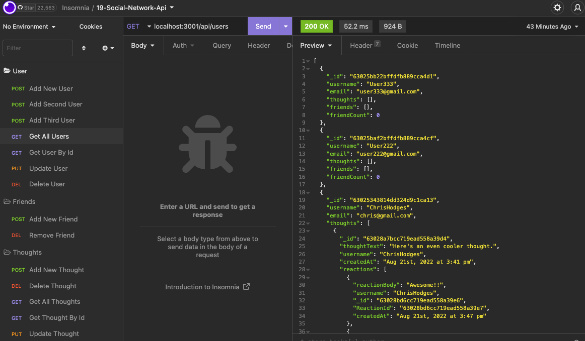

# Social-Network-Api

## Description
This is the backend api for a social networking application.  Insomnia can be used to explore and manipulate data via GET, POST, PUT, and DELETE routes.  The accessible data includes username, userID, email, thoughts(comments), reactions to thoughts, and friends.

* Made with node.js, express.js, and mongoose to interact with MongoDb.

## Installation/Directions
First, install dependencies by running `npm i` in the command line.  (Installs express.js and mongoose).
MongoDB and node.js are also required.

Use `npm run` to start the server and open Insomnia to add, view, delete, or change data in the database.

Use the following routes to access the data:
### User
* GET all users @ `/api/users`
* GET one user by id @ `/api/users/:userId`
* POST a new user @ `/api/users`  --> expects { 'username', 'email' }
* Update a user by id (PUT) @ `/api/users/:userId`
* DELETE a user @ `/api/users/:userId`

### Friend
* Add a friend (POST) @ `/api/users/:userId/friends/:friendId`
* DELETE a friend @ `/api/users/:userId/friends/:friendId`
* Note^^ The `friendId` is the `userId` of the friend to be added.

### Thought
* GET all thoughts @ `/api/thoughts`
* GET a thought by id @ `/api/thoughts/:thoughtId`
* Add a thought (POST) @ `/api/thoughts` -->  expects { 'username', 'userId', 'thoughtText' }
* Update a thought (PUT) @ `/api/thoughts/:thoughtId`
* DELETE a thought @ `/api/thoughts/:thoughtId`

### Reaction
* Create a reaction to a thought (POST) @ `/api/thoughts/:thoughtId/reactions` --> expects { 'reactionBody', 'username' }
* DELETE a reaction @ `/api/thoughts/:thoughtId/reactions/:reactionId`

## Screenshot

Example of Insomnia request to view all users

 

## Demo Video

Part 1: https://drive.google.com/file/d/1F712J36ngBpfiEiVsDZGkn-l5PkhZGY5/view

Part 2: https://drive.google.com/file/d/1aSHipFCz2z_iEjrYC8jDsPaIqMv15zuB/view

## Contributions
Created by Chris Hodges

## Questions
For any questions, contact me at chrisdhodges12@gmail.com or find me on GitHub at https://github.com/chrisdhodges12

